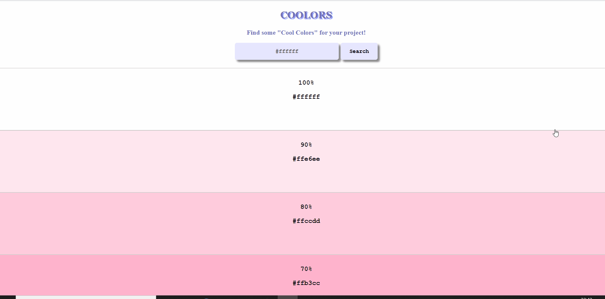

Forkify is a vanilla JavaScript application that interacts with the FORKIFY API to fetch and display recipe food data. The user can search for a specific recipe, and add ingredients to a shopping list or save to a favourites list via local storage.

## :film_projector: DEMO

